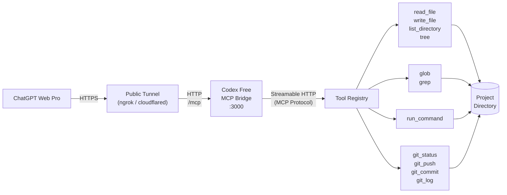

# Codex Free

*Codex Free (but you still have to buy ChatGPT Plus)*

A local MCP bridge server that lets ChatGPT Web Pro call tools on your machine: read/write files, run shell commands, git operations, search. Built with Bun + TypeScript, using `@modelcontextprotocol/sdk` over Streamable HTTP.

ChatGPT talks to a public tunnel URL, which forwards to this server running on your machine, which operates on a project directory you choose.

## Architecture



## Quick start

```bash
bun install
bun run main.ts --work-dir /path/to/your/project
```

Server starts on `http://localhost:3000`. MCP endpoint is `/mcp`.

## CLI flags

| Flag | Required | Default | Description |
|------|----------|---------|-------------|
| `--work-dir` | Yes | - | Project directory the tools operate on |
| `--port` | No | `3000` | Server port |
| `--api-key` | No | - | Bearer token for auth |
| `--config` | No | `./codex.config.json` | Config file path |

## Tools

| Tool | Description |
|------|-------------|
| `read_file` | Read a file's contents, with optional line offset/limit |
| `write_file` | Write content to a file, creating parent directories if needed |
| `run_command` | Execute a command in the work directory (allowlist-restricted) |
| `git_status` | Show git status, parsed into changed files with status codes |
| `git_push` | Push commits to a remote |
| `git_commit` | Create a commit, optionally staging all tracked changes |
| `git_log` | Show recent commit history |
| `glob` | Find files matching a glob pattern |
| `grep` | Search file contents by regex, with optional context lines |
| `list_directory` | List files and directories with name, type, and size |
| `tree` | Print directory tree as ASCII art |

All paths are resolved relative to `--work-dir`.

## Config file

`codex.config.json` in the project root, or pass a custom path with `--config`:

```json
{
  "allowedCommands": ["bun", "npm", "npx", "node", "git", "python", "pip", "cargo", "make"],
  "port": 3000,
  "tree": {
    "defaultDepth": 3,
    "ignore": ["node_modules", ".git", "dist", ".next", "__pycache__", ".venv", "venv"]
  },
  "command": {
    "defaultTimeout": 30000,
    "maxTimeout": 120000
  }
}
```

CLI flags override values from the config file.

## Connecting to ChatGPT

1. Start the server: `bun run main.ts --work-dir /path/to/your/project`
2. Expose it with a tunnel (ngrok, Cloudflare Tunnel, etc.):
   ```bash
   ngrok http 3000
   ```
3. In ChatGPT, go to **Settings > Connectors > Add MCP Server**.
4. Enter the tunnel URL with `/mcp` appended, e.g. `https://<your-tunnel>/mcp`.

If `--api-key` is set, add an `Authorization: Bearer <key>` header when configuring the connector.

## Security

- **Path traversal prevention**: every filesystem tool resolves paths through a guard that rejects anything outside `--work-dir`.
- **Command allowlist**: `run_command` only runs binaries listed in `allowedCommands`; everything else is rejected.
- **Optional bearer token auth**: set `--api-key` to require an `Authorization: Bearer <key>` header on all requests (except `/health`). Without it, anyone who can reach the port can use the tools.

This server has no sandboxing beyond the above. Anyone with access to the tunnel URL and API key can read, write, and execute commands in your work directory. Don't expose it without an API key, and don't point it at directories you don't trust ChatGPT with.

## Dev commands

```bash
bun run dev        # watch mode
bun test           # tests
bunx tsc --noEmit  # type check
```

## License

MIT - see [LICENSE](LICENSE).
